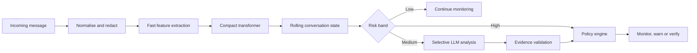

# PausePoint

PausePoint follows a conversation message by message and identifies when ordinary-looking contact develops into social engineering. It is designed around early detection: the system records *when* risk became actionable, not only whether a completed conversation contained a scam.

## Use case

```text
"I'm calling from your bank's fraud team."
"We need to act immediately."
"Do not discuss this with anyone."
"Read the six-digit OTP to me."
```

After each message, PausePoint updates the conversation stage, risk score and supporting evidence. A high-confidence credential or payment request can trigger an approved warning; ambiguous cases are escalated to an LLM evidence extractor.

## System flow



## Architecture

### Pre-processing

The runnable baseline applies Unicode NFKC normalisation, lowercasing and whitespace cleanup. It de-obfuscates spaced or punctuated terms such as `O.T.P`, masks URLs and extracts signals for phone numbers, currency amounts, OTPs, authority claims, urgency, secrecy, credential requests and transfers. The production experiment adds a spaCy entity pass and PII placeholders before model inference.

### Fast path

Every message is processed with the latest eight conversation turns. The implemented scorer combines linguistic indicators with an exponentially weighted risk state. It predicts five interpretable stages: `benign`, `authority`, `urgency`, `isolation`, and `credential_or_payment`.

The learned version replaces the rule score with `microsoft/deberta-v3-small`, fine-tuned as a multitask classifier for stage, scam risk and evidence spans, then exported to ONNX. Temperature scaling calibrates its probabilities. The target for the local fast path is p95 latency below 150–200 ms.

### Selective LLM path

Only uncertain or escalating conversations reach `Qwen2.5-7B-Instruct`. It runs with temperature `0` and constrained JSON output over numbered conversation turns, extracted entities and fast-path scores. Required fields include `claimed_identity`, `requested_action`, `pressure_tactics`, `scam_stage` and `supporting_messages`.

The response is rejected if its schema is invalid, a cited turn does not exist or the cited text does not support the extracted action. The LLM contributes evidence but never directly issues a warning or blocks a transaction.

### Post-processing

The implemented policy uses three risk bands and hysteresis so a conversation does not oscillate between safe and unsafe after every message. Explicit credential or transfer requests receive additional weight. The full model combines calibrated classifier probability, validated LLM fields and deterministic indicators with logistic regression. Warnings are selected from reviewed templates, and every decision records the score, stage, evidence and processing time.

## Data

- [UCI SMS Spam Collection](https://archive.ics.uci.edu/dataset/228/sms+spam+collection) for genuine single-message auxiliary training
- [Scam Conversation Corpus](https://zenodo.org/records/15212527) for multi-turn scammer interactions
- Reproducible, manually reviewed conversation scenarios for stage and early-detection evaluation

Single-message and constructed multi-turn results will be reported separately. Complete conversations are replayed one turn at a time, so the streaming model cannot use evidence from future messages.

## Evaluation

- stage macro-F1 and scam PR-AUC
- recall at a fixed false-positive rate
- first detection turn and early-detection AUC
- calibration error and Brier score
- evidence attribution accuracy
- LLM escalation and unsupported-evidence rates
- median and p95 latency
- messages per second and concurrent conversations
- compact-only versus LLM-only versus hybrid comparison

## Demonstration result

The included four-turn conversation moves from an authority claim to urgency, isolation and finally an OTP request. The streaming engine escalates from monitoring to LLM review on turn three and `warn_and_verify` on turn four. Each decision records its evidence and local processing time.

The recorded replay is available in [`results/demo_stream.jsonl`](results/demo_stream.jsonl).

## Run the streaming replay

Requires Python 3.10+ and no external packages.

```bash
python3 -m pausepoint.cli --conversation data/demo_conversation.jsonl
```

Run tests:

```bash
python3 -m unittest discover -s tests -v
```

## Limitations

- Public multi-turn scam data is smaller and less representative than production traffic.
- Legitimate fraud warnings can contain the same urgent language used by scammers.
- Code-switching, slang and adversarial spelling can reduce recall.
- Offline replay measures detection timing but not whether a warning prevents loss.
