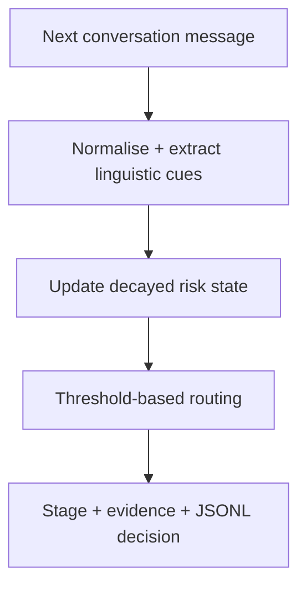

# PausePoint

Project report | Harsh Saand | 22 September 2026

## The problem

Social engineering can emerge over several messages. PausePoint records which cues appear at each turn and how accumulated risk changes as a conversation develops.

## What a user gets

Each message produces a stage label, evidence, a rule-derived risk index and a routing label in a replay record.

## Practical value

The runnable contribution is a stateful rule engine and a reproducible four-turn demonstration. It does not execute the proposed transformer or LLM, send warnings, or establish fraud-prevention performance.

## Logic and flow



<details>
<summary><strong>Use case</strong></summary>

After each message, PausePoint updates the conversation stage, risk score and supporting evidence. Explicit credential or payment cues can trigger a `warn_and_verify` routing label; intermediate scores produce `llm_review`. The runnable engine does not execute an LLM or deliver a user warning.

</details>

<details>
<summary><strong>Architecture: implemented baseline and proposed extensions</strong></summary>

### Pre-processing

The runnable baseline applies Unicode NFKC normalisation, lowercasing and whitespace cleanup. It de-obfuscates spaced or punctuated terms such as `O.T.P`, masks URLs and extracts signals for phone numbers, currency amounts, OTPs, authority claims, urgency, secrecy, credential requests and transfers. A proposed extension would add a spaCy entity pass and PII placeholders before model inference.

### Fast path

The engine processes each new message and carries forward a decayed risk state; it retains up to eight recent records. The implemented scorer combines linguistic indicators with an exponentially weighted risk state. It predicts five interpretable stages: `benign`, `authority`, `urgency`, `isolation`, and `credential_or_payment`.

A proposed learned version would replace the rule score with `microsoft/deberta-v3-small`, fine-tuned as a multitask classifier for stage, scam risk and evidence spans, then exported to ONNX. Temperature scaling calibrates its probabilities. The target for the local fast path is p95 latency below 150-200 ms.

### Post-processing

The implemented policy uses three threshold-based risk bands and a decayed risk state; it does not implement separate enter/exit thresholds for hysteresis. Explicit credential or transfer requests receive additional weight. A proposed full model would combine calibrated classifier probability, validated LLM fields and deterministic indicators with logistic regression. The baseline emits routing labels rather than rendered warnings; every decision records the score, stage, evidence and processing time.

</details>

<details>
<summary><strong>Demonstration result</strong></summary>

The included four-turn conversation moves from an authority claim to urgency, isolation and finally an OTP request. The streaming engine changes from monitoring to the `llm_review` routing label on turn three and `warn_and_verify` on turn four. Each decision records its evidence and local processing time.

The recorded replay is available in [`results/demo_stream.jsonl`](https://github.com/HarshSaand/pausepoint/blob/f1a9063b02f0c90b208d3ca5e90536b5f4113ab9/results/demo_stream.jsonl).

</details>

<details>
<summary><strong>Limitations</strong></summary>

- Public multi-turn scam data is smaller and less representative than production traffic.
- Legitimate fraud warnings can contain the same urgent language used by scammers.
- Code-switching, slang and adversarial spelling can reduce recall.
- Offline replay measures detection timing but not whether a warning prevents loss.

</details>

<details>
<summary><strong>Run the streaming replay</strong></summary>

Requires Python 3.10+ and no external packages.

```bash
python3 -m pausepoint.cli --conversation data/demo_conversation.jsonl
```

Run tests:

```bash
python3 -m unittest discover -s tests -v
```

</details>

## Evidence and reproduction references

Source revision: f1a9063b02f0c90b208d3ca5e90536b5f4113ab9

- [README.md](https://github.com/HarshSaand/pausepoint/blob/f1a9063b02f0c90b208d3ca5e90536b5f4113ab9/README.md)
- [docs/output-example.json](https://github.com/HarshSaand/pausepoint/blob/f1a9063b02f0c90b208d3ca5e90536b5f4113ab9/docs/output-example.json)
- [results/demo_stream.jsonl](https://github.com/HarshSaand/pausepoint/blob/f1a9063b02f0c90b208d3ca5e90536b5f4113ab9/results/demo_stream.jsonl)

This report describes the source and saved evidence at the revision above. Training and full benchmark runs were not repeated for this documentation release. Dataset, model and dependency licences remain separate from the project documentation.
